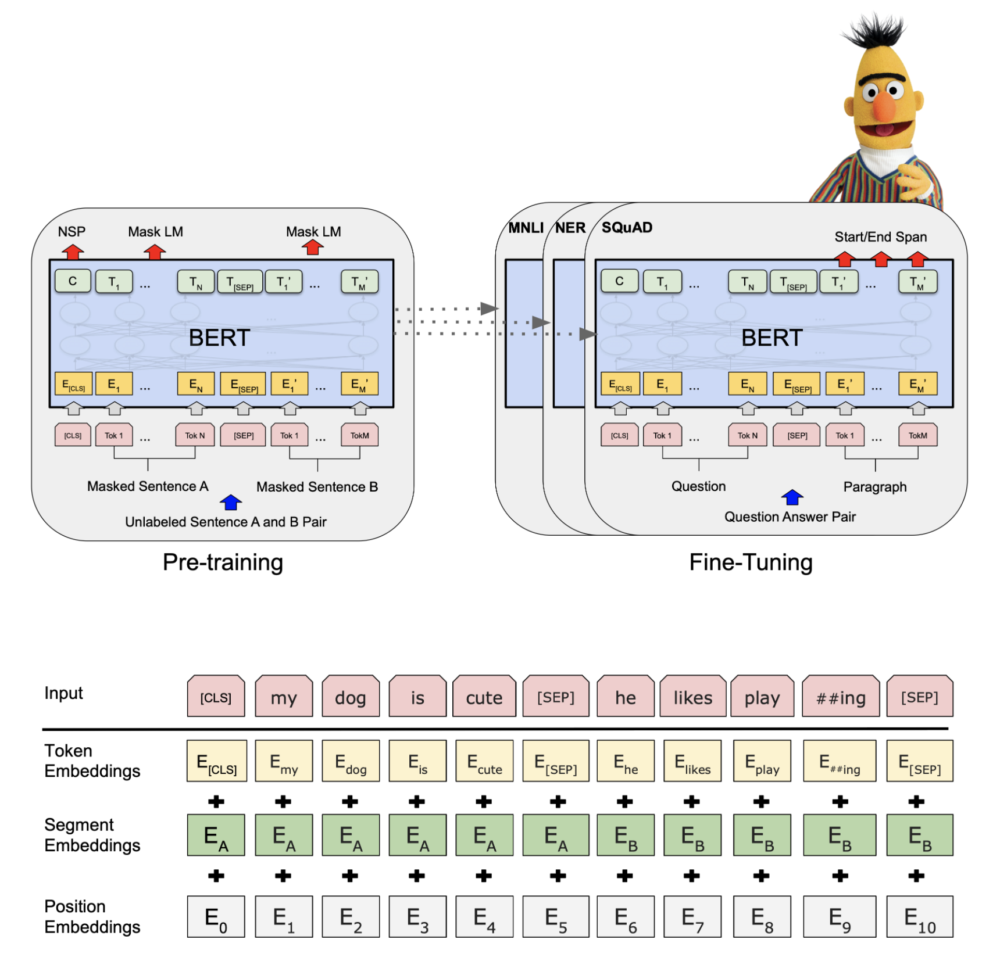

## NLP: Sentiment Analysis and Bitcoin Return Prediction Using FinBERT

### PREREQUISITES

- Basic knowledge on Deep Learning and Natural Language
- Exposure to Pytorch

#### BERT VS FinBERT

BERT is a popular natural language processing (NLP) pre-trained model developed by Google, which is widely used for sentiment analysis. By further training the BERT language model in the finance domain, FinBERT is created. It is trained on a large
financial corpus and fine-tuned for financial sentiment classification.

#### DATASET

- S&P 500 Constitutents from Wiki
- Stock and Bitcoin Daily Price from Yahoo Finance API
- Daily Financial News for 6000+ Stocks (~4m articles for 6,000 stocks from 2009-2020)
- Over 10,000 Twitter tweets (55% non-disaster, 45% disaster) for testing
- Over 3 million Twitter tweets on Bitcoin

#### PROJECT DESCRIPTION
First, we compare the performance of FinBERT with base-BERT model on both financial and non-financial text data. 	The results show that FinBERT performs better on financial text data as expected but performs worse on non-financial text data in sentiment analysis task.

Second, we use FinBERT in sentiment analysis to obtain sentiment score on tweets. Then we
use the obtained score to predict future Bitcoin return and price movements. We find that adding the sentiment score as a feature could improve the prediction of Bitcoin’s next-day return, but the performance improvement hinges on the machine learning model adopted.

#### REFERENCES

_[1] Devlin, Jacob, et al., Bert: Pre-training of deep bidirectional
transformers for language understanding. arXiv preprint
arXiv:1810.04805 (2018)._

_[2] GregoryW. Eaton, T. Clifton Green, Brian S. Roseman, and
Yanbin Wu. Retail Trader Sophistication and Stock Market
Quality: Evidence from Brokerage Outages. Working paper,
2021._

_[3] Basant Agarwal and Namita Mittal. Machine Learning Approach
for Sentiment Analysis. Springer International Publishing,
2016_

_[4] Oscar Araque, Ignacio Corcuera-Platas, J. Fernando
Sánchez-Rada, and Carlos A. Enhancing deep learning sentiment
analysis with ensemble techniques in social applications.
Expert Systems with Applications, 2017_

_[5] Jeremy Howard and Sebastian Ruder. Universal Language
Model Finetuning for Text Classification. arXiv, 2018_

 